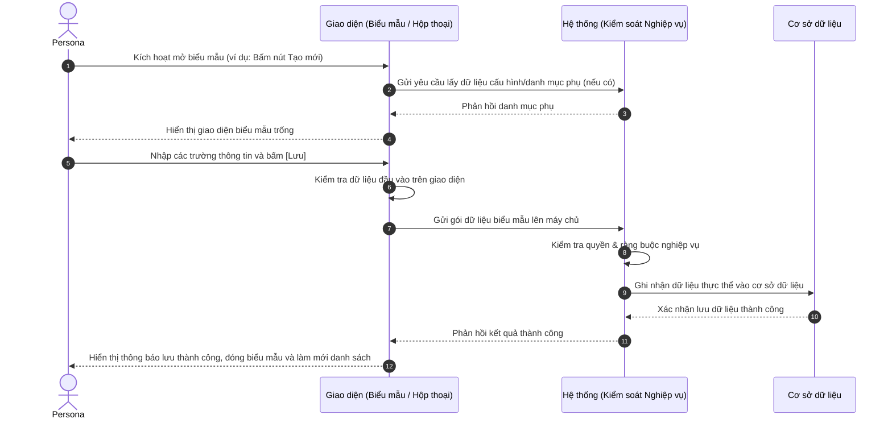

# US-XXX-YY-ZZ: [Tên Biểu Mẫu Tạo/Sửa]

> **Tham chiếu:** BF-XXX-YY · SR-PERSONA-XXX · Giao diện Mẫu §4.4 (Biểu mẫu / Hộp thoại biểu mẫu)
> **Đường dẫn màn hình & Trạng thái liên quan:**
> - `[Đường dẫn gọi biểu mẫu hoặc Hộp thoại]` -> Trạng thái: `[Các trạng thái được phép]`

---

## 1. NHẬT KÝ THAY ĐỔI & BỐI CẢNH (CHANGELOG & CONTEXT)

### Lịch sử cập nhật tài liệu (Changelog)

| Ngày cập nhật | Nội dung cập nhật | Lý do cập nhật |
|---|---|---|
| [Ngày/Tháng/Năm] | Tóm tắt nội dung thay đổi | Lý do (Ví dụ: Chốt luồng, thay đổi UI...) |

### Bối cảnh & Vấn đề nghiệp vụ (Context & Problem)
* **Bối cảnh:** [Tóm tắt bối cảnh nghiệp vụ từ tài liệu BF cha để hiểu nguồn gốc tính năng.]
* **Vấn đề hiện tại:** [Khó khăn/vấn đề cụ thể mà biểu mẫu này sẽ giải quyết (ví dụ: quy trình nhập liệu thủ công dễ sai sót, chưa có kiểm soát dữ liệu...).]
* **Mục tiêu & Giá trị mang lại:** [Mục tiêu cụ thể khi biểu mẫu này đi vào vận hành và giá trị mang lại cho tổ chức. KPI đo lường nếu có.]

### Hiểu người dùng & Tình huống sử dụng (User Needs & Use Cases)
* **Người dùng chính (Persona):** [Persona] (Ví dụ: PERSONA-CSM)
* **Khó khăn lớn nhất (Pain-points):** [Khó khăn lớn nhất của đối tượng này khi nhập liệu hoặc cập nhật thông tin.]
* **Nhu cầu thực tế (Needs):** [Mong muốn thực tế của người dùng đối với các tính năng trên biểu mẫu (ví dụ: muốn tự động điền, muốn báo lỗi rõ ràng...).]
* **Câu phát biểu nghiệp vụ:** **Là một** [Persona], **tôi muốn** [nhập thông tin trên biểu mẫu], **để** [tạo mới hoặc cập nhật dữ liệu của thực thể].

### Phạm vi kiểm soát (Scope)
* **Phạm vi đầu vào:** [Dữ liệu đầu vào và các thực thể liên quan]
* **Ràng buộc nghiệp vụ toàn cục (Global Rules):**
  > [!IMPORTANT]
  > **Lưu ý di trú:**
  > Đối với màn hình di trú giao diện và sử dụng hệ thống cũ, ghi rõ: *"Kế thừa toàn bộ ràng buộc nghiệp vụ từ hệ thống cũ"*. KHÔNG tự định nghĩa mới các quy tắc kinh doanh hoặc thông số định mức nghiệp vụ thuộc về hệ thống cũ.
  - **[Mã quy tắc (Ví dụ: RULE-FORM-01)] [Tên quy tắc]:** Mô tả ràng buộc phụ thuộc giữa các trường hoặc điều kiện nhập liệu phía giao diện.
  - **[Mã quy tắc (Ví dụ: RULE-FORM-02)] [Tên quy tắc]:** Mô tả quy cách hiển thị hoặc tự động định dạng nhập liệu (mặt nạ nhập liệu).
  - **[Mã định mức (Ví dụ: GLOBAL-METRIC-01)] Giới hạn nhập liệu phía giao diện:** Các giới hạn ký tự, số lượng tối đa của tệp đính kèm được kiểm tra trực tiếp trên giao diện (hoặc kế thừa từ giới hạn hệ thống cũ).

---

## 2. LUỒNG XỬ LÝ CHÍNH (MAIN FLOW - HAPPY PATH)

*Mô tả luồng đi của người dùng từ khi mở biểu mẫu, nhập thông tin hợp lệ cho đến khi lưu dữ liệu thành công.*



---

## 3. GIAO DIỆN & TRẠNG THÁI TĨNH (DATA & UI STATE)

### 3.1. Thiết kế trực quan (Figma)
* **Link/Hình ảnh Figma:** [Ghi vị trí để User chèn link thiết kế]

### 3.2. Cấu trúc các trường nhập liệu & Quy tắc kiểm tra (Validation Rules)
*Bố cục biểu mẫu: [1 Cột / 2 Cột / Hộp thoại trượt]*

| Tên trường thông tin | Kiểu hiển thị | Bắt buộc | Nguồn dữ liệu | Định dạng & Độ dài (Min/Max) | Ràng buộc Duy nhất (Unique) | Diễn giải quy tắc kiểm duyệt dữ liệu |
|---|---|---|---|---|---|---|
| [Tên trường A] | Ô nhập chữ | Có | Người dùng nhập | Chữ thường, 2-100 ký tự | [Có / Không] | Không chứa ký tự đặc biệt. Báo lỗi nếu bỏ trống. |
| [Tên trường B] | Ô chọn thả xuống | Có | Danh mục hệ thống | - | Không | Chọn một trong các giá trị danh mục. |

### 3.3. Nút hành động biểu mẫu
| Tên nút | Kiểu hiển thị | Logic xử lý nghiệp vụ | Điều kiện hiển thị | Mobile Responsive |
|---------|---------------|-----------------------|---------------------|-------------------|
| Hủy bỏ | Nút viền nhạt | Đóng biểu mẫu, không lưu thông tin, xóa sạch dữ liệu vừa nhập. | Luôn hiển thị | Hiển thị đầy đủ |
| Lưu | Nút màu nhấn | Thực hiện kiểm tra toàn bộ trường dữ liệu → Gửi lưu → Đóng biểu mẫu → Tải lại danh sách. | Luôn hiển thị | Hiển thị đầy đủ |

### 3.4. Ma trận phân quyền (Permission Matrix)
*Xác định vai trò nào được phép thao tác mở biểu mẫu và lưu dữ liệu.*

| Vai trò người dùng | Mở biểu mẫu tạo (Create) | Mở biểu mẫu sửa (Edit) | Thực hiện Lưu (Save) |
|---|:---:|:---:|:---:|
| **Quản trị viên (Admin / Owner)** | ✅ | ✅ | ✅ |
| **Quản lý cơ sở (Branch Manager)** | ✅ | ✅ | ✅ |
| **Nhân viên CSKH (CSM)** | [Có/Không] | [Có/Không] | [Có/Không] |
| **Nhân viên tư vấn (Sale)** | [Có/Không] | ❌ | [Có/Không] |
| **Giáo viên (Teacher)** | ❌ | ❌ | ❌ |

---

## 4. KHỐI CHỨC NĂNG CHI TIẾT: ACTION & LUỒNG KÍCH HOẠT (ACTIONS & EVENTS)

### Khối chức năng 1: Tương tác và Lưu dữ liệu trên Biểu mẫu

#### Action 1.1: Bấm nút [Lưu]
* **Luồng kích hoạt (Event/Flow):** Người dùng bấm nút [Lưu] sau khi hoàn thành nhập thông tin. Giao diện chạy kiểm tra dữ liệu, sau đó gửi gói dữ liệu biểu mẫu lên máy chủ để ghi nhận.
* **Quy tắc kiểm soát & Kiểm tra dữ liệu (Validation & Rules):**
  - Chặn không cho lưu nếu các trường bắt buộc (`Bắt buộc = Có`) bị trống hoặc sai định dạng.
* **Tiêu chí nghiệm thu (Acceptance Criteria):** (Yêu cầu $\ge 3$ AC, bao gồm happy + unhappy/alternate paths)
  - **AC-1 (Happy Path - Lưu dữ liệu thành công):**
    - **Giả sử:** Biểu mẫu đã điền đầy đủ các thông tin bắt buộc và đúng định dạng.
    - **Khi:** Người dùng click nút [Lưu].
    - **Thì:** Giao diện đóng biểu mẫu, hiển thị thông báo thành công "Lưu dữ liệu thành công", làm mới danh sách chính để cập nhật bản ghi mới.
  - **AC-2 (Alternate Path - Lỗi bỏ trống trường bắt buộc):**
    - **Giả sử:** Biểu mẫu đang mở và trường Tên thực thể đang để trống.
    - **Khi:** Người dùng click nút [Lưu].
    - **Thì:** Trường Tên hiển thị viền đỏ và dòng chữ cảnh báo lỗi "Vui lòng nhập tên thực thể", chặn không gửi yêu cầu lên máy chủ.
  - **AC-3 (Alternate Path - Lỗi nhập sai định dạng đặc thù):**
    - **Giả sử:** Ô nhập số điện thoại đang nhập chữ cái.
    - **Khi:** Người dùng click nút [Lưu].
    - **Thì:** Trường số điện thoại báo lỗi "Số điện thoại không hợp lệ", chặn không gửi lưu.

#### Action 1.2: Bấm nút [Hủy bỏ]
* **Luồng kích hoạt (Event/Flow):** Người dùng bấm nút Hủy bỏ hoặc bấm phím Esc. Giao diện thực hiện hủy bỏ phiên làm việc hiện tại và quay về màn trước.
* **Tiêu chí nghiệm thu (Acceptance Criteria):**
  - **AC-1 (Happy Path - Hủy bỏ phiên thành công):**
    - **Giả sử:** Người dùng đang mở biểu mẫu tạo mới và chưa thay đổi dữ liệu nào.
    - **Khi:** Người dùng click nút [Hủy bỏ] (hoặc bấm dấu x ở góc).
    - **Thì:** Biểu mẫu đóng lại ngay lập tức, không lưu dữ liệu, xóa sạch nội dung và hiển thị lại màn hình danh sách chính.

---

## 5. ĐẶC TẢ KẾT NỐI HỆ THỐNG (API SPECIFICATION)
*Mô tả cấu trúc dữ liệu trao đổi giữa giao diện và hệ thống phía sau khi gửi lưu biểu mẫu (hoặc ghi N/A nếu là màn hình tĩnh).*

*   **Endpoint:** `POST /api/v1/[some-endpoint]` hoặc `PUT /api/v1/[some-endpoint]/{id}`
*   **Cấu trúc dữ liệu gửi đi (Request Payload - JSON):**
    ```json
    {
      "name": "string",
      "category_id": "string"
    }
    ```
*   **Cấu trúc dữ liệu phản hồi thành công (Response JSON - 200 OK / 201 Created):**
    ```json
    {
      "success": true,
      "data": {
        "id": "string",
        "name": "string",
        "category_id": "string",
        "created_at": "string"
      }
    }
    ```
*   **Mã lỗi thường gặp (Response Error Codes):**
    *   `400 Bad Request`: Thiếu trường dữ liệu bắt buộc hoặc sai định dạng.
    *   `409 Conflict`: Trùng lặp dữ liệu duy nhất (Unique constraint).
    *   `401 Unauthorized`: Hết hạn phiên làm việc.
    *   `403 Forbidden`: Không có quyền cập nhật dữ liệu.
    *   `500 Internal Server Error`: Lỗi máy chủ.

---

## 6. CÁC TRƯỜNG HỢP GÓC CẠNH & LUỒNG NGOẠI LỆ (CORNER CASES & EXCEPTION FLOWS)

*Mô tả chi tiết xử lý ngoại lệ (dữ liệu sai, mất mạng, timeout, hết hạn phiên) đối với màn hình biểu mẫu:*

- **[CASE-01] Người dùng nhập trùng dữ liệu duy nhất (Exception Flow - Unique Constraint):**
  - *Tình huống:* Người dùng nhập mã hoặc tên thực thể đã tồn tại trong hệ thống.
  - *Cách xử lý:* Máy chủ trả về mã lỗi 409, hệ thống hiển thị cảnh báo đỏ tại trường liên quan: "Thông tin này đã tồn tại. Vui lòng nhập giá trị khác."
- **[CASE-02] Nhập ký tự đặc biệt hoặc mã script nguy hiểm (Exception Flow - Input Sanitization):**
  - *Tình huống:* Người dùng cố tình sao chép các ký tự html/script để phá hoại giao diện.
  - *Cách xử lý:* Hệ thống tự động lọc (sanitize) hoặc báo lỗi "Dữ liệu chứa ký tự không được cho phép".
- **[CASE-03] Mất kết nối mạng khi đang gửi yêu cầu lưu (Exception Flow - Network Loss):**
  - *Tình huống:* Người dùng bấm nút [Lưu] đúng lúc đường truyền internet bị ngắt.
  - *Cách xử lý:* Hiển thị thông báo lỗi kết nối, giữ nguyên giao diện biểu mẫu và các thông tin đã nhập để người dùng không bị mất công gõ lại và có thể gửi lại khi mạng ổn định.
- **[CASE-04] Thời gian phản hồi lưu dữ liệu bị timeout (Exception Flow - Timeout):**
  - *Tình huống:* Máy chủ quá tải khiến yêu cầu lưu kéo dài quá 10 giây không có phản hồi.
  - *Cách xử lý:* Hủy yêu cầu, hiển thị thông báo "Hệ thống phản hồi chậm. Vui lòng kiểm tra lại kết nối mạng hoặc thử lại sau."
- **[CASE-05] Đóng biểu mẫu khi có dữ liệu đã thay đổi chưa lưu (Exception Flow - Unsaved Changes):**
  - *Tình huống:* Người dùng đã sửa một vài trường nhưng bấm [Hủy bỏ] hoặc click ra ngoài hộp thoại.
  - *Cách xử lý:* Hiển thị một hộp thoại xác nhận (Confirm Dialog): "Bạn có những thay đổi chưa lưu. Bạn có chắc chắn muốn rời đi?" nhằm tránh mất mát dữ liệu do vô tình click nhầm.

