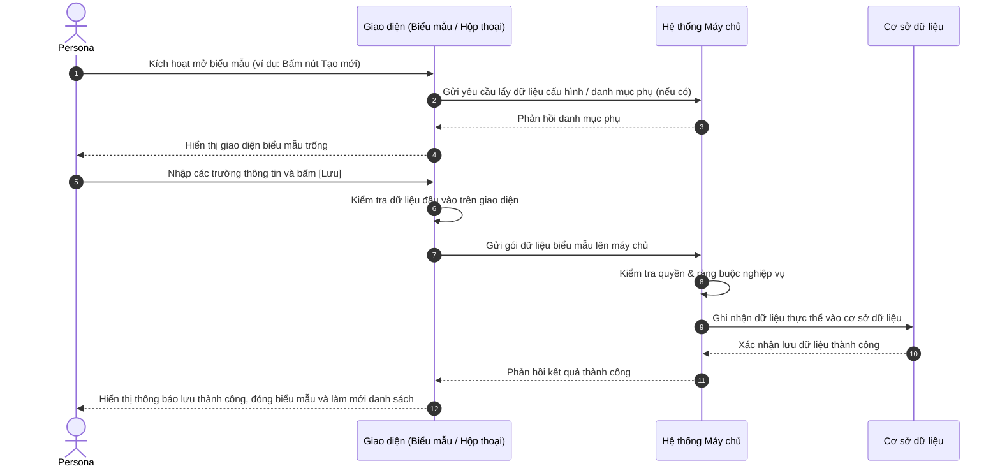

# US-XXX-YY-ZZ: [Tên Biểu Mẫu Tạo/Sửa]

> **Tham chiếu:** `BF-XXX-YY` · `SR-PERSONA-XXX`  
> **Đường dẫn màn hình & Trạng thái liên quan:**  
> - `[Đường dẫn gọi biểu mẫu hoặc Hộp thoại nổi]` -> Trạng thái: `[Các trạng thái áp dụng]`  

---

## 1. NHẬT KÝ THAY ĐỔI & BỐI CẢNH (CHANGELOG & CONTEXT)

### Lịch sử cập nhật tài liệu (Changelog)

| Ngày cập nhật | Nội dung cập nhật | Lý do cập nhật |
|---|---|---|
| [Ngày/Tháng/Năm] | [Tóm tắt nội dung thay đổi] | [Lý do cập nhật] |

### Bối cảnh & Vấn đề nghiệp vụ (Context & Problem)
* **Bối cảnh:** [Người dùng tự điền bối cảnh phát sinh biểu mẫu này]
* **Vấn đề hiện tại:** [Người dùng tự điền khó khăn/vấn đề cụ thể mà biểu mẫu này giải quyết]
* **Mục tiêu & Giá trị mang lại:** [Người dùng tự điền mục tiêu khi biểu mẫu này đi vào vận hành]

### Hiểu người dùng & Tình huống sử dụng (User Needs & Use Cases)
* **Người dùng chính (Persona):** `[PERSONA-XXX]`
* **Nhu cầu thực tế (Needs):** [Mong muốn thực tế của người dùng khi nhập liệu trên biểu mẫu]
* **Câu phát biểu nghiệp vụ:** **Là một** [Persona], **tôi muốn** [nhập thông tin trên biểu mẫu], **để** [tạo mới hoặc cập nhật dữ liệu của thực thể].

---

## 2. LUỒNG XỬ LÝ CHÍNH (MAIN FLOW - HAPPY PATH)



---

## 3. GIAO DIỆN & CẤU TRÚC BIỂU MẪU (DATA & UI STATE)

### 3.1. Cấu trúc các trường nhập liệu & Ràng buộc kiểm tra (Validation Rules)

| Tên trường thông tin | Kiểu hiển thị | Bắt buộc | Nguồn dữ liệu | Định dạng & Giới hạn | Diễn giải quy tắc kiểm duyệt dữ liệu |
|---|---|:---:|---|---|---|
| **[Tên trường A]** | Ô nhập chữ | **Có (*)** | Người dùng nhập | Chữ thường, 2-100 ký tự | Báo lỗi nếu bỏ trống |
| **[Tên trường B]** | Ô chọn thả xuống | **Có (*)** | Danh mục hệ thống | Danh sách lựa chọn | Chọn một trong các giá trị danh mục |
| **[Tên trường C]** | Ô chọn ngày | Không | Người dùng chọn | `DD/MM/YYYY` | Tùy chọn |

### 3.2. Nút hành động biểu mẫu
| Tên nút | Kiểu hiển thị | Logic xử lý nghiệp vụ | Mã Quyền Yêu Cầu (Required Capability) |
|---|---|---|---|
| **Hủy bỏ** | Nút viền nhạt | Đóng biểu mẫu, không lưu thông tin, xóa sạch dữ liệu vừa nhập | `<domain>.<entity>.view` |
| **Lưu / Xác nhận** | Nút màu nhấn | Kiểm tra toàn bộ trường dữ liệu $\rightarrow$ Gửi lưu $\rightarrow$ Đóng biểu mẫu $\rightarrow$ Tải lại danh sách | `<domain>.<entity>.create` / `<domain>.<entity>.edit` |

---

## 4. TIÊU CHÍ NGHIỆM THU (ACCEPTANCE CRITERIA - BDD GHERKIN)

```gherkin
Scenario: Lưu dữ liệu thành công (Happy Path)
  Given Biểu mẫu đang mở và đã điền đầy đủ các thông tin bắt buộc
  When Người dùng bấm nút [Lưu]
  Then Hệ thống lưu bản ghi mới thành công
    And đóng biểu mẫu và làm mới danh sách ngoài.

Scenario: Chặn lưu khi thiếu trường bắt buộc (Validation Error)
  Given Người dùng mở biểu mẫu nhưng chưa điền trường bắt buộc
  When Người dùng bấm nút [Lưu]
  Then Hệ thống cảnh báo viền đỏ tại trường bị thiếu
    And không gửi dữ liệu lưu lên máy chủ.
```

---

## 5. CÁC TRƯỜNG HỢP GÓC CẠNH & LUỒNG NGOẠI LỆ (CORNER CASES & EXCEPTION FLOWS)

- **[CASE-01] Trùng lặp dữ liệu duy nhất (Unique Constraint):**
  - *Tình huống:* Người dùng nhập mã hoặc tên đã tồn tại trong hệ thống.
  - *Cách xử lý:* Hệ thống cảnh báo "Thông tin này đã tồn tại trong hệ thống. Vui lòng nhập giá trị khác."
- **[CASE-02] Mất kết nối mạng khi đang gửi lưu:**
  - *Tình huống:* Người dùng bấm [Lưu] đúng lúc đường truyền bị ngắt.
  - *Cách xử lý:* Giữ nguyên biểu mẫu và toàn bộ dữ liệu đã nhập, hiển thị thông báo lỗi kết nối kèm nút gửi lại.
- **[CASE-03] Đóng biểu mẫu khi có dữ liệu đã thay đổi chưa lưu:**
  - *Tình huống:* Người dùng đã chỉnh sửa một vài trường nhưng bấm [Hủy bỏ] hoặc click ra ngoài.
  - *Cách xử lý:* Hiển thị hộp thoại xác nhận: "Bạn có những thay đổi chưa lưu. Bạn có chắc chắn muốn đóng?".
