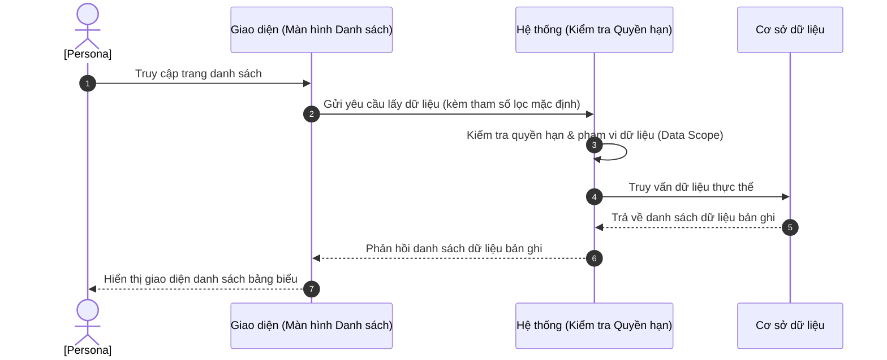

# US-XXX-YY-ZZ: [Tên Màn Hình Danh Sách]

> **Tham chiếu:** BF-XXX-YY · SR-PERSONA-XXX · Giao diện Mẫu §4.2 (Danh sách)
> **Đường dẫn màn hình & Trạng thái liên quan:**
> - `[Đường dẫn URL 1]` -> Trạng thái: `[Trạng thái A]`
> - `[Đường dẫn URL 2]` -> Trạng thái: `[Trạng thái B]`

---

## 1. NHẬT KÝ THAY ĐỔI & BỐI CẢNH (CHANGELOG & CONTEXT)

### Lịch sử cập nhật tài liệu (Changelog)

| Ngày cập nhật | Nội dung cập nhật | Lý do cập nhật |
|---|---|---|
| [Ngày/Tháng/Năm] | Tóm tắt nội dung thay đổi | Lý do (Ví dụ: Chốt luồng, thay đổi UI...) |

### Bối cảnh & Vấn đề nghiệp vụ (Context & Problem)
* **Bối cảnh:** [Tóm tắt bối cảnh nghiệp vụ từ tài liệu BF cha để hiểu nguồn gốc tính năng.]
* **Vấn đề hiện tại:** [Khó khăn/vấn đề cụ thể mà màn hình danh sách này sẽ giải quyết (ví dụ: mất nhiều thời gian tra cứu thủ công, dữ liệu thiếu đồng bộ...).]
* **Mục tiêu & Giá trị mang lại:** [Mục tiêu cụ thể khi màn hình này đi vào vận hành và giá trị mang lại cho tổ chức. KPI đo lường nếu có.]

### Hiểu người dùng & Tình huống sử dụng (User Needs & Use Cases)
* **Người dùng chính (Persona):** [Persona] (Ví dụ: PERSONA-CSM)
* **Khó khăn lớn nhất (Pain-points):** [Khó khăn lớn nhất của đối tượng này khi thao tác hoặc xử lý nghiệp vụ liên quan.]
* **Nhu cầu thực tế (Needs):** [Mong muốn thực tế của người dùng đối với các tính năng trên màn hình (ví dụ: muốn lọc nhanh, muốn thấy ngay trạng thái...).]
* **Câu phát biểu nghiệp vụ:** **Là một** [Persona], **tôi muốn** [xem danh sách thực thể có lọc và tìm kiếm], **để** [nhanh chóng tìm ra thông tin và thực hiện các thao tác tiếp theo].

### Phạm vi kiểm soát (Scope)
* **Phạm vi hiển thị:** [Thực thể dữ liệu chính hiển thị và các liên kết liên quan]
* **Ràng buộc nghiệp vụ toàn cục (Global Rules):**
  > [!IMPORTANT]
  > **Lưu ý di trú:**
  > Đối với màn hình di trú giao diện và sử dụng hệ thống cũ, ghi rõ: *"Kế thừa toàn bộ ràng buộc nghiệp vụ từ hệ thống cũ"*. KHÔNG tự định nghĩa mới các quy tắc kinh doanh hoặc thông số định mức nghiệp vụ thuộc về hệ thống cũ.
  - **[Mã quy tắc (Ví dụ: RULE-LIST-01)] [Tên quy tắc]:** Mô tả ràng buộc nghiệp vụ chung hoặc quy trình hiển thị trạng thái mặc định.
  - **[Mã quy tắc (Ví dụ: RULE-LIST-02)] [Tên quy tắc]:** Mô tả các trường thông tin hỗ trợ tìm kiếm nhanh không phân biệt chữ hoa chữ thường.
  - **[Mã định mức (Ví dụ: GLOBAL-METRIC-01)] Số lượng bản ghi mặc định:** Quy định số lượng bản ghi hiển thị mặc định trên một trang giao diện (Ví dụ: 20 bản ghi, cho phép chọn 20, 50, 100).
  - **[Mã định mức (Ví dụ: GLOBAL-METRIC-02)] Giới hạn xuất dữ liệu:** Giới hạn số lượng dòng tối đa khi xuất báo cáo hiển thị ở giao diện (hoặc kế thừa từ giới hạn hệ thống cũ).

---

## 2. LUỒNG XỬ LÝ CHÍNH (MAIN FLOW - HAPPY PATH)

*Mô tả luồng đi của người dùng từ khi truy cập màn hình danh sách, lọc tìm kiếm cho đến khi bấm xem chi tiết.*



---

## 3. GIAO DIỆN & TRẠNG THÁI TĨNH (DATA & UI STATE)

### 3.1. Thiết kế trực quan (Figma)
* **Link/Hình ảnh Figma:** [Ghi vị trí chèn link thiết kế]

### 3.2. Cấu trúc các vùng giao diện
Màn hình danh sách tuân thủ bố cục chuẩn gồm: Thanh công cụ bộ lọc → Thẻ trạng thái nhanh (Status Tiles) → Bảng danh sách chính → Bộ phân trang ở dưới cùng.

#### A. Thanh công cụ & Bộ lọc nhanh
| Thành phần | Loại hiển thị | Giá trị mặc định | Logic xử lý / Điều kiện hiển thị | Mobile Responsive |
|------------|---------------|------------------|----------------------------------|-------------------|
| [Bộ lọc phân loại] | Ô chọn danh sách thả xuống | [Giá trị mặc định] | Lọc dữ liệu theo tiêu chí được chọn | [Quy tắc hiển thị trên di động] |
| Bộ lọc nâng cao | Hộp thoại lọc nổi (Sheet) | Trống | Cho phép chọn các tiêu chí lọc phụ | Thu gọn thành nút phễu |
| Ô tìm kiếm nhanh | Ô nhập chữ | Trống | Tìm theo các trường chính. Gợi ý: "Tìm..." | Đầy đủ |
| Nút Tạo mới | Nút màu nhấn | - | Bấm để mở hộp thoại Tạo mới thực thể | Chuyển thành nút dấu cộng (+) |

#### B. Khối lọc nhanh theo trạng thái (Status Tiles)
| Thẻ Trạng thái | Nhóm màu hiển thị | Điều kiện lọc | Diễn giải | Mobile Responsive |
|----------------|-------------------|----------------|-----------|-------------------|
| Tất cả | Mặc định | Bỏ lọc trạng thái | Hiển thị tổng số bản ghi | Cuộn ngang hiển thị |
| [Trạng thái A] | Xanh lá | Trạng thái = "A" | Số bản ghi ở trạng thái A | Cuộn ngang hiển thị |
| [Trạng thái B] | Đỏ / Cam | Trạng thái = "B" | Số bản ghi ở trạng thái B | Cuộn ngang hiển thị |

#### C. Bảng dữ liệu danh sách chính
| Cột thông tin | Kiểu hiển thị | Nguồn dữ liệu | Quy tắc thị giác & Trạng thái (Visual Mapping) | Mobile Responsive |
|---------------|---------------|----------------|------------------------------------------------|-------------------|
| **[Tên cột chính]** | Chữ đậm lớn + ảnh đại diện | Thực thể chính | Đi kèm mã định danh hiển thị mờ bên dưới | Giữ nguyên trên di động |
| **Trạng thái** | Nhãn màu (Badge) | Trường trạng thái | Áp dụng màu chuẩn trạng thái | Thu gọn thành biểu tượng tròn |
| **Ngày tạo** | Văn bản thường | Trường ngày tạo | Định dạng hiển thị ngày tháng | Ẩn trên di động |
| **Hành động dòng** | Nút biểu tượng | Hệ thống | Nút bấm thao tác xuất hiện khi rê chuột vào dòng | Luôn hiện nút biểu tượng bên phải dòng |

### 3.3. Các trạng thái giao diện mặc định
1. **Trạng thái đang tải (Loading state):** Hiển thị hiệu ứng chờ tải dữ liệu giả lập (Skeleton) tương ứng với cấu trúc bảng danh sách.
2. **Trạng thái chưa có dữ liệu (Trống - Empty state):** Hiển thị hình ảnh minh họa mờ kèm thông điệp báo trạng thái trống chuẩn của hệ thống.
3. **Trạng thái lỗi tải dữ liệu (Error state):** Hiển thị cảnh báo lỗi kết nối máy chủ/hệ thống và nút bấm để người dùng tải lại trang.

### 3.4. Ma trận phân quyền (Permission Matrix)
*Xác định rõ vai trò nào được phép thực hiện hành động tương ứng trên giao diện.*

| Vai trò người dùng | Xem danh sách (View) | Lọc & Tìm kiếm | Xuất dữ liệu (Export) | Xem chi tiết (Detail) | Tạo mới / Sửa / Xóa |
|---|:---:|:---:|:---:|:---:|:---:|
| **Quản trị viên (Admin / Owner)** | ✅ | ✅ | ✅ | ✅ | ✅ |
| **Quản lý cơ sở (Branch Manager)** | ✅ | ✅ | ✅ | ✅ | ✅ |
| **Nhân viên CSKH (CSM)** | ✅ | ✅ | ❌ | ✅ | [Có/Không] |
| **Nhân viên tư vấn (Sale)** | [Có/Không] | [Có/Không] | ❌ | [Có/Không] | ❌ |
| **Giáo viên (Teacher)** | [Có/Không] | [Có/Không] | ❌ | [Có/Không] | ❌ |

---

## 4. KHỐI CHỨC NĂNG CHI TIẾT: ACTION & LUỒNG KÍCH HOẠT (ACTIONS & EVENTS)

### Khối chức năng 1: Lọc và Tìm kiếm nhanh

#### Action 1.1: Nhập từ khóa tìm kiếm
* **Luồng kích hoạt (Event/Flow):** Khi người dùng nhập ký tự và dừng gõ 300ms, hệ thống gửi gói yêu cầu chứa từ khóa tìm kiếm lên máy chủ để truy vấn dữ liệu.
* **Quy tắc kiểm soát & Kiểm tra dữ liệu (Validation & Rules):**
  - Hệ thống tự động cắt bỏ khoảng trắng thừa ở hai đầu từ khóa trước khi truy vấn.
* **Tiêu chí nghiệm thu (Acceptance Criteria):** (Yêu cầu $\ge 3$ AC, bao gồm happy + unhappy/alternate paths)
  - **AC-1 (Happy Path - Tìm thấy kết quả):**
    - **Giả sử:** Bảng danh sách đang có dữ liệu và có bản ghi chứa tên "[Từ khóa mẫu]".
    - **Khi:** Người dùng nhập "[Từ khóa mẫu]" vào ô tìm kiếm nhanh.
    - **Thì:** Bảng danh sách tự động cập nhật hiển thị các bản ghi thỏa mãn điều kiện tìm kiếm.
  - **AC-2 (Alternate Path - Không tìm thấy kết quả):**
    - **Giả sử:** Bảng danh sách đang hiển thị.
    - **Khi:** Người dùng nhập từ khóa "[Từ khóa không tồn tại]" không khớp với bất kỳ dữ liệu nào.
    - **Thì:** Bảng danh sách hiển thị thông báo trạng thái trống, không tìm thấy kết quả phù hợp.
  - **AC-3 (Alternate Path - Nhập từ khóa cực ngắn):**
    - **Giả sử:** Màn hình danh sách đang hiển thị đầy đủ bản ghi.
    - **Khi:** Người dùng nhập 1 ký tự duy nhất vào ô tìm kiếm.
    - **Thì:** Hệ thống vẫn thực hiện tìm kiếm dựa trên ký tự đó (hoặc hiển thị gợi ý yêu cầu nhập tối thiểu 2 ký tự nếu có cấu hình).

#### Action 1.2: Chọn Thẻ Trạng thái (Status Tile)
* **Luồng kích hoạt (Event/Flow):** Khi người dùng click vào một thẻ trạng thái, hệ thống kích hoạt bộ lọc theo trạng thái tương ứng và tải lại dữ liệu.
* **Tiêu chí nghiệm thu (Acceptance Criteria):**
  - **AC-1 (Happy Path - Lọc thành công):**
    - **Giả sử:** Người dùng đang ở màn hình danh sách và ô bộ lọc đang chọn trạng thái mặc định "Tất cả".
    - **Khi:** Người dùng click vào thẻ trạng thái "[Trạng thái chọn]".
    - **Thì:** Thẻ trạng thái "[Trạng thái chọn]" chuyển sang chế độ được chọn (đổi màu viền/nền), và bảng danh sách chỉ hiển thị các bản ghi ở trạng thái tương ứng.

---

### Khối chức năng 2: Thao tác trên Dòng dữ liệu

#### Action 2.1: Click nút [Xem chi tiết]
* **Luồng kích hoạt (Event/Flow):** Người dùng click vào nút Xem chi tiết trên một dòng dữ liệu, hệ thống hiển thị Hộp thoại chi tiết của bản ghi.
* **Tiêu chí nghiệm thu (Acceptance Criteria):**
  - **AC-1 (Happy Path - Mở chi tiết thành công):**
    - **Giả sử:** Người dùng đang xem bảng danh sách.
    - **Khi:** Người dùng click vào nút Xem chi tiết trên dòng dữ liệu của bản ghi mã "[Mã bản ghi mẫu]".
    - **Thì:** Hệ thống mở hộp thoại nổi hiển thị đầy đủ thông tin chi tiết của bản ghi tương ứng.

---

## 5. ĐẶC TẢ KẾT NỐI HỆ THỐNG (API SPECIFICATION)
*Mô tả cấu trúc dữ liệu trao đổi giữa giao diện và hệ thống phía sau (hoặc ghi N/A nếu là màn hình tĩnh).*

*   **Endpoint:** `GET /api/v1/[some-endpoint]`
*   **Tham số gửi đi (Request Query Parameters):**
    *   `search` (string, optional): Từ khóa tìm kiếm.
    *   `status` (string, optional): Bộ lọc trạng thái.
    *   `page` (number, optional, default: 1): Số thứ tự trang.
    *   `limit` (number, optional, default: 20): Số lượng dòng/trang.
*   **Cấu trúc dữ liệu phản hồi thành công (Response JSON - 200 OK):**
    ```json
    {
      "success": true,
      "data": [
        {
          "id": "string",
          "name": "string",
          "status": "string"
        }
      ],
      "pagination": {
        "total": 120,
        "page": 1,
        "limit": 20
      }
    }
    ```
*   **Mã lỗi thường gặp (Response Error Codes):**
    *   `400 Bad Request`: Tham số gửi lên không đúng định dạng.
    *   `401 Unauthorized`: Hết hạn phiên đăng nhập hoặc chưa đăng nhập.
    *   `403 Forbidden`: Người dùng không có quyền truy cập dữ liệu này.
    *   `500 Internal Server Error`: Lỗi hệ thống máy chủ.

---

## 6. CÁC TRƯỜNG HỢP GÓC CẠNH & LUỒNG NGOẠI LỆ (CORNER CASES & EXCEPTION FLOWS)

*Mô tả chi tiết xử lý ngoại lệ (mất mạng, quyền, timeout, lỗi dữ liệu) đối với màn hình danh sách:*

- **[CASE-01] Mất kết nối mạng khi đang thực hiện lọc hoặc tìm kiếm (Exception Flow - Network Loss):**
  - *Tình huống:* Người dùng thay đổi bộ lọc hoặc bấm tìm kiếm nhưng đường truyền internet bị mất.
  - *Cách xử lý:* Hiển thị hộp báo lỗi tải dữ liệu (Error State) kèm nút thử lại mà không làm mất trạng thái lọc đã chọn trước đó.
- **[CASE-02] Kết quả lọc/tìm kiếm rỗng (Exception Flow - Empty Results):**
  - *Tình huống:* Bộ lọc kết hợp quá sâu hoặc từ khóa không khớp dẫn đến không tìm thấy bản ghi nào.
  - *Cách xử lý:* Ẩn bộ phân trang, hiển thị giao diện trống (Empty State) và thông báo hướng dẫn người dùng thiết lập lại bộ lọc hoặc tìm kiếm từ khóa khác.
- **[CASE-03] Không đủ quyền truy cập dữ liệu (Exception Flow - Insufficient Permission):**
  - *Tình huống:* Người dùng mở liên kết trang danh sách qua URL nhưng tài khoản không có quyền truy cập module này.
  - *Cách xử lý:* Hệ thống chặn hiển thị bảng dữ liệu, hiển thị thông báo lỗi "Bạn không có quyền truy cập trang này" hoặc tự động chuyển hướng về trang chủ.
- **[CASE-04] Thời gian phản hồi hệ thống bị timeout (Exception Flow - Gateway Timeout):**
  - *Tình huống:* Yêu cầu tải dữ liệu danh sách kéo dài quá 10 giây do máy chủ quá tải.
  - *Cách xử lý:* Hệ thống hủy yêu cầu (abort), hiển thị thông báo "Hệ thống phản hồi chậm. Vui lòng kiểm tra lại kết nối và thử lại."
- **[CASE-05] Xung đột dữ liệu phiên bản hiển thị cũ (Exception Flow - Outdated View):**
  - *Tình huống:* Bản ghi đã bị xóa hoặc thay đổi trạng thái bởi người dùng khác, nhưng giao diện của người dùng hiện tại chưa tải lại.
  - *Cách xử lý:* Khi người dùng bấm xem chi tiết dòng bị xóa, hệ thống báo lỗi không tìm thấy bản ghi và tự động làm mới danh sách bảng biểu.

