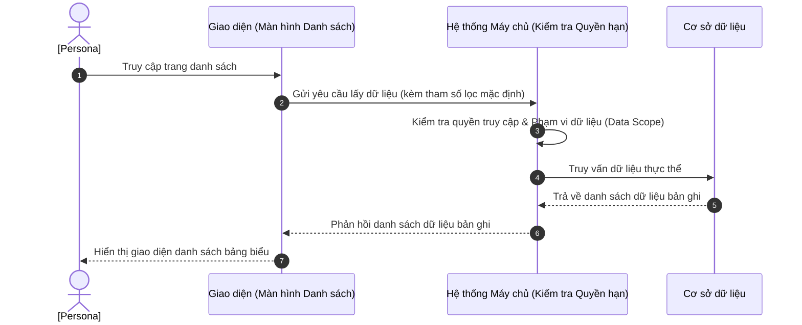

# US-XXX-YY-ZZ: [Tên Màn Hình Danh Sách]

> **Tham chiếu:** `BF-XXX-YY` · `SR-PERSONA-XXX`  
> **Đường dẫn màn hình & Trạng thái liên quan:**  
> - `/app/[menu_id]` -> Trạng thái: `[Các trạng thái hợp lệ]`  

---

## 1. NHẬT KÝ THAY ĐỔI & BỐI CẢNH (CHANGELOG & CONTEXT)

### Lịch sử cập nhật tài liệu (Changelog)

| Ngày cập nhật | Nội dung cập nhật | Lý do cập nhật |
|---|---|---|
| [Ngày/Tháng/Năm] | [Tóm tắt nội dung thay đổi] | [Lý do cập nhật] |

### Bối cảnh & Vấn đề nghiệp vụ (Context & Problem)
* **Bối cảnh:** [Người dùng tự điền bối cảnh nghiệp vụ từ tài liệu BF cha]
* **Vấn đề hiện tại:** [Người dùng tự điền khó khăn/vấn đề cụ thể mà màn hình danh sách này giải quyết]
* **Mục tiêu & Giá trị mang lại:** [Người dùng tự điền mục tiêu khi màn hình này đi vào vận hành]

### Hiểu người dùng & Tình huống sử dụng (User Needs & Use Cases)
* **Người dùng chính (Persona):** `[PERSONA-XXX]`
* **Nhu cầu thực tế (Needs):** [Mong muốn thực tế của người dùng khi thao tác trên màn hình danh sách]
* **Câu phát biểu nghiệp vụ:** **Là một** [Persona], **tôi muốn** [xem danh sách thực thể có lọc và tìm kiếm], **để** [nhanh chóng tìm ra thông tin và thực hiện các thao tác tiếp theo].

### Phạm vi kiểm soát (Scope)
* **Phạm vi hiển thị:** [Thực thể dữ liệu chính hiển thị và các liên kết liên quan]

---

## 2. LUỒNG XỬ LÝ CHÍNH (MAIN FLOW - HAPPY PATH)

---

## 3. GIAO DIỆN & KIỂM SOÁT QUYỀN HẠN (UI & CAPABILITY GATING)

### 3.1. Cấu trúc các vùng giao diện & Ràng buộc Quyền hạn (Capability Gating)

Màn hình áp dụng cơ chế kiểm soát hiển thị theo **Mã Quyền Động (Atomic Permissions)** được định nghĩa tại `BF-XXX-YY` §5.2:

| Vùng Giao diện / Nút Thao Tác | Loại Hiển Thị | Mã Quyền Yêu Cầu (Required Capability) | Xử Lý Khi Không Đủ Quyền |
| :--- | :--- | :--- | :--- |
| **Truy cập Màn hình `/app/[menu_id]`** | Toàn bộ giao diện | `<domain>.<entity>.view` | Chặn truy cập, hiển thị màn hình 403 Forbidden |
| **Thanh công cụ Bộ lọc & Tìm kiếm** | Ô thả xuống & Ô tìm kiếm | `<domain>.<entity>.filter` | Vô hiệu hóa hoặc ẩn thanh công cụ lọc |
| **Nhấp dòng Xem Chi tiết** | Hộp thoại trượt (Drawer) / Modal | `<domain>.<entity>.view_detail` | Không kích hoạt mở xem chi tiết |
| **Nút [➕ Tạo mới]** | Nút hành động | `<domain>.<entity>.create` | Ẩn nút tạo mới |
| **Nút [Xuất dữ liệu]** | Nút trên thanh Header / Toolbar | `<domain>.<entity>.export` | Ẩn nút xuất dữ liệu |

### 3.2. Cấu trúc dữ liệu bảng chính

| Cột thông tin | Kiểu hiển thị | Nguồn dữ liệu | Quy tắc thị giác (Visual Mapping) |
|---|---|---|---|
| **[Tên cột chính]** | Chữ đậm lớn + mã định danh mờ | Thực thể chính | Đi kèm định danh hiển thị mờ bên dưới |
| **Trạng thái** | Nhãn màu (Badge) | Trường trạng thái | Áp dụng màu chuẩn trạng thái |
| **Ngày tạo** | Văn bản thường | Trường ngày tạo | Định dạng `DD/MM/YYYY` |
| **Thao tác dòng** | Nút biểu tượng | Tác vụ dòng | Nút bấm thao tác xuất hiện trên dòng |

---

## 4. KHỐI CHỨC NĂNG CHI TIẾT: ACTION & LUỒNG KÍCH HOẠT (ACTIONS & EVENTS)

### Khối chức năng 1: Lọc và Tìm kiếm nhanh

#### Action 1.1: Nhập từ khóa tìm kiếm
* **Luồng kích hoạt:** Khi người dùng nhập ký tự và dừng gõ 300ms, hệ thống thực hiện lọc dữ liệu.
* **Tiêu chí nghiệm thu (Acceptance Criteria):**
  - **AC-1 (Happy Path - Tìm thấy kết quả):**
    - **Giả sử:** Bảng danh sách đang có dữ liệu và có bản ghi chứa tên "[Từ khóa mẫu]".
    - **Khi:** Người dùng nhập "[Từ khóa mẫu]" vào ô tìm kiếm nhanh.
    - **Thì:** Bảng danh sách tự động cập nhật hiển thị các bản ghi thỏa mãn điều kiện tìm kiếm.
  - **AC-2 (Alternate Path - Không tìm thấy kết quả):**
    - **Giả sử:** Bảng danh sách đang hiển thị.
    - **Khi:** Người dùng nhập từ khóa không khớp với bất kỳ dữ liệu nào.
    - **Thì:** Bảng danh sách hiển thị thông báo trạng thái trống (Empty State).

#### Action 1.2: Chọn Thẻ Trạng thái (Status Tile) / Radio Lọc
* **Luồng kích hoạt:** Khi người dùng click vào một thẻ trạng thái hoặc nút radio lọc, hệ thống kích hoạt lọc theo trạng thái tương ứng.
* **Tiêu chí nghiệm thu:**
  - **AC-1 (Happy Path - Lọc thành công):** Bảng danh sách cập nhật hiển thị các bản ghi thuộc trạng thái được chọn.

---

### Khối chức năng 2: Thao tác trên Dòng dữ liệu

#### Action 2.1: Click nút [Xem chi tiết]
* **Luồng kích hoạt:** Người dùng click vào nút Xem chi tiết trên một dòng dữ liệu, hệ thống hiển thị Hộp thoại/Drawer chi tiết của bản ghi.
* **Tiêu chí nghiệm thu:**
  - **AC-1 (Happy Path):** Hệ thống mở hộp thoại/Drawer hiển thị đầy đủ thông tin chi tiết của bản ghi tương ứng.

---

## 5. CÁC TRƯỜNG HỢP GÓC CẠNH & LUỒNG NGOẠI LỆ (CORNER CASES & EXCEPTION FLOWS)

- **[CASE-01] Mất kết nối mạng khi đang thực hiện lọc hoặc tìm kiếm:**
  - *Tình huống:* Người dùng thay đổi bộ lọc hoặc bấm tìm kiếm nhưng đường truyền internet bị mất.
  - *Cách xử lý:* Hiển thị hộp báo lỗi tải dữ liệu (Error State) kèm nút thử lại mà không làm mất trạng thái lọc đã chọn trước đó.
- **[CASE-02] Kết quả lọc/tìm kiếm rỗng:**
  - *Tình huống:* Bộ lọc kết hợp quá sâu hoặc từ khóa không khớp dẫn đến không tìm thấy bản ghi nào.
  - *Cách xử lý:* Ẩn bộ phân trang, hiển thị giao diện trống (Empty State) và thông báo hướng dẫn người dùng thiết lập lại bộ lọc.
- **[CASE-03] Không đủ quyền truy cập dữ liệu (Data Scope):**
  - *Tình huống:* Người dùng mở liên kết trang danh sách qua URL nhưng tài khoản không có quyền truy cập module này hoặc cơ sở này.
  - *Cách xử lý:* Hệ thống chặn hiển thị bảng dữ liệu, hiển thị thông báo lỗi 403 Forbidden.
- **[CASE-04] Thời gian phản hồi hệ thống bị timeout:**
  - *Tình huống:* Yêu cầu tải dữ liệu danh sách kéo dài quá 10 giây do máy chủ quá tải.
  - *Cách xử lý:* Hệ thống hủy yêu cầu (abort), hiển thị thông báo lỗi phản hồi chậm kèm nút thử lại.
